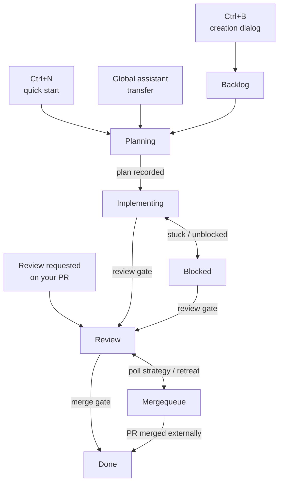
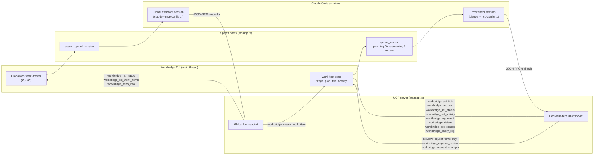

<div align="center">
  
  <h1>Workbridge</h1>
  <p><strong>Multi-repo Claude Code orchestration in your terminal.</strong></p>
</div>

Workbridge is a terminal UI for orchestrating multi-repo development work. It
tracks work items, manages git worktrees, and drives Claude Code sessions
through a Backlog -> Planning -> Implementing -> Review -> Done workflow.

## Table of Contents

- [Quick Start](#quick-start)
  - [1. Enable the git hooks](#1-enable-the-git-hooks)
  - [2. Build and install Workbridge](#2-build-and-install-workbridge)
  - [3. Register the repos you want to manage](#3-register-the-repos-you-want-to-manage)
  - [4. Launch the TUI](#4-launch-the-tui)
  - [5. Start your first quick-start session](#5-start-your-first-quick-start-session)
  - [Global assistant drawer](#global-assistant-drawer)
- [How It Works](#how-it-works)
  - [Work Item Lifecycle](#work-item-lifecycle)
  - [MCP Communication](#mcp-communication)
- [Further Reading](#further-reading)
- [License](#license)

## Quick Start

### 1. Enable the git hooks

The `hooks/` directory contains git hooks that enforce code quality:

- **pre-commit** - runs `cargo fmt --check` and `cargo clippy` (lint + format)
- **pre-push** - checks for unstaged/untracked files, then runs `cargo test`

Enable them once after cloning:

```sh
git config core.hooksPath hooks
```

This is a per-repo setting.

### 2. Build and install Workbridge

Workbridge is a Rust project. Build a release binary and put it on your PATH:

```sh
cargo install --path .
```

For local development, `cargo run -- <args>` works the same way as the
installed `workbridge` binary.

### 3. Register the repos you want to manage

Workbridge does not walk your filesystem. You tell it which repos to scan,
either one at a time or by registering a base directory that gets scanned one
level deep:

```sh
workbridge repos add .                  # register the current repo
workbridge repos add ~/Projects/foo     # register a specific repo
workbridge repos add-base ~/Projects    # discover repos under ~/Projects
```

Repos added with `repos add` are always active. Repos discovered under a base
directory start unmanaged - opt them in from the TUI settings overlay (`?`)
or with an explicit `repos add`. See [docs/repository-registry.md](docs/repository-registry.md)
for the full CLI reference and config file format.

### 4. Launch the TUI

```sh
workbridge
```

The left panel lists work items grouped by status. Press `?` at any time to
open the settings overlay (config path, base dirs, managed/available repos,
defaults).

### 5. Start your first quick-start session

Press `Ctrl+N` to begin a quick-start session. If you have exactly one managed
repo, Workbridge skips the dialog and creates a Planning work item immediately
with a placeholder title; otherwise a compact "Quick start - select repo"
dialog appears so you can pick the repo with Up/Down + Space, then Enter.

The Claude session that spawns will ask what you want to work on, set a real
title via MCP, and walk through planning. When planning is done it records the
plan and the item is ready to advance to Implementing. See
[docs/work-items.md](docs/work-items.md) for the full lifecycle, including
the review and merge gates.

`Ctrl+B` opens the full creation dialog (title, description, repos, branch)
if you want to create a Backlog item instead of jumping straight into
planning.

### Global assistant drawer

Press `Ctrl+G` at any time to open the global assistant drawer. Unlike a
work item session, the global assistant has read-only access to all your
managed repos and work items, and can create new work items on your behalf
via MCP. Use it to explore across repos, ask "what is in flight right now",
or kick off a Planning work item from a freeform conversation.

## How It Works

Work items are Workbridge's central abstraction. Each one owns a branch, a
worktree, an optional GitHub issue, and an optional PR, and moves through a
linear sequence of stages driven by Claude Code sessions. Two gates protect
the flow: the **review gate** (PR exists, CI is green, adversarial code
review passes the plan-vs-implementation check) and the **merge gate** (the
PR is actually merged on GitHub).

### Work Item Lifecycle



See [docs/work-items.md](docs/work-items.md) for the full stage semantics,
gate behavior, and review-request workflow.

### MCP Communication

Workbridge talks to each Claude Code session via MCP over a per-session Unix
domain socket. When a session is spawned (work item planning, implementing,
review-request handling, or the global assistant drawer), Workbridge starts
a small MCP server, launches `claude` with an `--mcp-config` that points at
a bridge process, and waits for tool calls. Each tool call becomes an
`McpEvent` on a crossbeam channel that the TUI applies on its main thread.



The headless review and rebase gates spawn similar sessions with restricted
tool sets; see `src/mcp.rs` for the full per-stage tool list.

## Further Reading

- [CONTRIBUTING.md](CONTRIBUTING.md) - coding standards, error handling, UI rules
- [docs/repository-registry.md](docs/repository-registry.md) - repo registration and config
- [docs/work-items.md](docs/work-items.md) - work item lifecycle and stages
- [docs/UI.md](docs/UI.md) - TUI layout and interactions
- [docs/invariants.md](docs/invariants.md) - project invariants (read-only)

## License

Workbridge is released under the MIT License. See [LICENSE](LICENSE) for the
full text.
