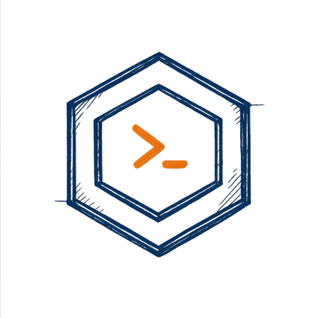
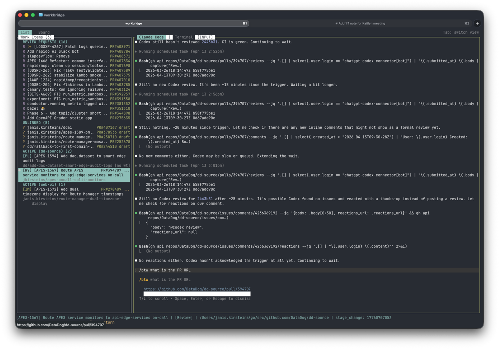
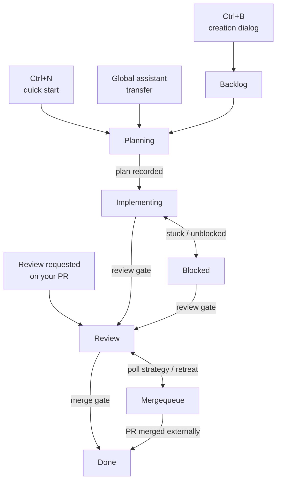
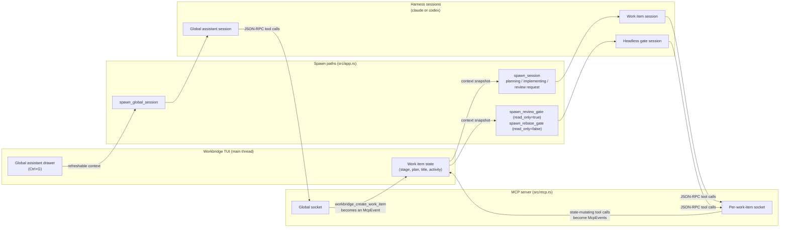

<div align="center">
  
  <h1>Workbridge</h1>
  <p><strong>Multi-repo coding agent orchestration in your terminal.</strong></p>
</div>

Workbridge is a terminal UI for orchestrating multi-repo development work. It
tracks work items, manages git worktrees, and drives coding agent sessions
through a Backlog -> Planning -> Implementing -> Review -> Done workflow.

<div align="center">
  
</div>

## Table of Contents

- [Quick Start](#quick-start)
  - [1. Enable the git hooks](#1-enable-the-git-hooks)
  - [2. Build and install Workbridge](#2-build-and-install-workbridge)
  - [3. Register the repos you want to manage](#3-register-the-repos-you-want-to-manage)
  - [4. Launch the TUI](#4-launch-the-tui)
  - [5. Start your first quick-start session](#5-start-your-first-quick-start-session)
- [How It Works](#how-it-works)
  - [Work Item Lifecycle](#work-item-lifecycle)
  - [Global assistant drawer](#global-assistant-drawer)
  - [MCP Communication](#mcp-communication)
- [Compatibility](#compatibility)
- [Per-harness permission model](#per-harness-permission-model)
- [Further Reading](#further-reading)
- [License](#license)

## Quick Start

### 1. Enable the git hooks

The `hooks/` directory contains git hooks that enforce code quality:

- **pre-commit** - runs `cargo fmt --check` and `cargo clippy` (lint + format)
- **pre-push** - checks for unstaged/untracked files, then runs `cargo test`

Enable them once after cloning:

```sh
git config core.hooksPath hooks
```

This is a per-repo setting.

### 2. Build and install Workbridge

Workbridge is a Rust project. Build a release binary and put it on your PATH:

```sh
cargo install --path .
```

For local development, `cargo run -- <args>` works the same way as the
installed `workbridge` binary.

### 3. Register the repos you want to manage

Workbridge does not walk your filesystem. You tell it which repos to scan,
either one at a time or by registering a base directory that gets scanned one
level deep:

```sh
workbridge repos add .                  # register the current repo
workbridge repos add ~/Projects/foo     # register a specific repo
workbridge repos add-base ~/Projects    # discover repos under ~/Projects
```

Repos added with `repos add` are always active. Repos discovered under a base
directory start unmanaged - opt them in from the TUI settings overlay (`?`)
or with an explicit `repos add`. See [docs/repository-registry.md](docs/repository-registry.md)
for the full CLI reference and config file format.

### 4. Launch the TUI

```sh
workbridge
```

The left panel lists work items grouped by status. Press `?` at any time to
open the settings overlay (config path, base dirs, managed/available repos,
defaults).

Before starting work, open the **Review Gate** tab in the settings overlay
(`?`, then Tab to reach the Review Gate tab) and set the "Skill (slash
command)" field. The value is passed verbatim to whichever coding agent runs
the review gate, so it can be a slash command (e.g.
`/claude-adversarial-review` for Claude Code) or plain-text guidance that any
coding agent can follow. The default is a Claude Code slash command - update
it if you are using a different coding agent.

### 5. Start your first quick-start session

Press `Ctrl+N` to begin a quick-start session. If you have exactly one managed
repo, Workbridge skips the dialog and creates a Planning work item immediately
with a placeholder title; otherwise a compact "Quick start - select repo"
dialog appears so you can pick the repo with Up/Down + Space, then Enter.

The coding agent session that spawns will ask what you want to work on, set a
real title via MCP, and walk through planning. When planning is done it records the
plan and the item is ready to advance to Implementing. See
[docs/work-items.md](docs/work-items.md) for the full lifecycle, including
the review and merge gates.

`Ctrl+B` opens the full creation dialog (title, description, repos, branch)
if you want to create a Backlog item instead of jumping straight into
planning.

## How It Works

Work items are Workbridge's central abstraction. Each one owns a branch, a
worktree, an optional GitHub issue, and an optional PR, and moves through a
linear sequence of stages driven by coding agent sessions. Two gates protect
the flow: the **review gate** (PR exists, CI is green, adversarial code
review passes the plan-vs-implementation check) and the **merge gate** (the
PR is actually merged on GitHub).

### Work Item Lifecycle



See [docs/work-items.md](docs/work-items.md) for the full stage semantics,
gate behavior, and review-request workflow.

### Global assistant drawer

Press `Ctrl+G` at any time to open the global assistant drawer. Unlike a
work item session, the global assistant has read-only access to all your
managed repos and work items, and can create new work items on your behalf
via the `workbridge_create_work_item` MCP tool. Use it to explore across
repos, ask "what is in flight right now", or kick off a Planning work item
from a freeform conversation - that last path is what the lifecycle
diagram above shows as the `Global assistant transfer -> Planning` edge.

### MCP Communication

Workbridge talks to each harness session over a per-session Unix domain
socket. The harness binary is `claude` or `codex`, picked per work item
via the `c` / `x` keys (see
[docs/harness-contract.md](docs/harness-contract.md)); the MCP tool
surface is the same for both adapters, only the spawn-side flag syntax
differs (`--mcp-config <file>` for Claude, `-c mcp_servers.<name>.*`
TOML overrides for Codex). When a session is spawned - work item
planning, implementing, review-request handling, the headless review or
rebase gate, or the global assistant drawer - Workbridge starts a small
MCP server on a fresh socket and configures the harness to spawn
`workbridge --mcp-bridge --socket <path>` as its MCP server. The bridge
subprocess pipes stdin/stdout to the socket so the harness's JSON-RPC
tool calls reach the in-process server.

Each session is handed a context blob at spawn time: a frozen snapshot
for work-item sessions, and an `Arc<Mutex<String>>` that the TUI
refreshes periodically for the global assistant. State-mutating tool
calls become `McpEvent`s on a crossbeam channel that the TUI applies on
its main thread; read-only tool calls are served directly by the MCP
server from that context (or, for `workbridge_query_log`, from the
on-disk activity log) without round-tripping through the TUI.



Per-session tool surface (see `src/mcp.rs` for the source of truth):

- **Interactive work-item session** and **rebase gate**: read-only
  `workbridge_get_context`, `workbridge_query_log`; mutating
  `workbridge_log_event`, `workbridge_set_activity`,
  `workbridge_delete`, `workbridge_set_status`, `workbridge_set_plan`,
  `workbridge_set_title`. The rebase gate is spawned with
  `read_only=false` and gets the same mutating set as the interactive
  session - it has to call `workbridge_log_event` to stream live
  rebase progress back to the TUI.
- **Review-request work-item session**: same read-only tools plus
  `workbridge_log_event`, `workbridge_set_activity`, and
  `workbridge_delete`; `set_status` / `set_plan` / `set_title` are
  replaced by `workbridge_approve_review` and
  `workbridge_request_changes`.
- **Review gate** (headless, `read_only=true`):
  `workbridge_get_context`, `workbridge_query_log`,
  `workbridge_get_plan`, `workbridge_report_progress`. Mutating tools
  are not exposed in `tools/list` and are rejected at `tools/call`
  even if the harness asks for them by name.
- **Global assistant session** (separate socket, separate handler):
  read-only `workbridge_list_repos`, `workbridge_list_work_items`,
  `workbridge_repo_info`; mutating `workbridge_create_work_item`,
  which spawns a new Planning work item.

## Compatibility

Workbridge is harness-agnostic. Any CLI that satisfies the clauses in
[`docs/harness-contract.md`](docs/harness-contract.md) can be plugged in. Today
the shipping adapters are:

- **Claude Code** - reference adapter. Drives every workflow stage including
  the headless review gate.
- **Codex** - first-class secondary adapter. Drives every workflow stage.
  Uses a handful of CLI-level workarounds for features that Codex does not
  expose directly (see footnotes below and the per-clause notes in
  `docs/harness-contract.md`).
- **opencode** - planned. The adapter enum has a stub variant; the harness
  is not yet selectable from the picker.

Pick the harness per work item with `c` (Claude Code) / `x` (Codex) in the
work item list; the right-panel session tab title reflects the harness
actually running in the live session.

### Feature matrix

User-observable features, per harness. "Partial" means the feature works end
to end but via a different mechanism than Claude Code, and may differ in
granularity. See `docs/harness-contract.md` for the authoritative technical
contract.

| Feature                                        | Claude Code | Codex     | opencode |
| ---------------------------------------------- | :---------: | :-------: | :------: |
| Planning sessions (interactive PTY)            | Yes         | Yes       | Planned  |
| Implementing / Blocked sessions (interactive)  | Yes         | Yes       | Planned  |
| Review sessions (interactive)                  | Yes         | Yes       | Planned  |
| Review gate (headless, structured output)      | Yes         | Yes       | Planned  |
| Global assistant (`Ctrl+G`)                    | Yes         | Yes       | Planned  |
| Workbridge MCP server injection                | Yes         | Partial*  | Planned  |
| CLI-level tool allowlist                       | Yes         | Partial** | Planned  |
| Stage reminders (periodic nudges)              | Yes         | Partial***| Planned  |
| Fresh-session-per-stage invariant              | Yes         | Yes       | Planned  |

\* Claude Code accepts a single `--mcp-config <file>` JSON blob; Codex reads
its MCP servers from `~/.codex/config.toml` and is fed via per-field `-c
mcp_servers.workbridge.*=...` overrides instead. Functionally equivalent from
the user's perspective; see `docs/harness-contract.md` C4.

\** Claude Code enforces the workbridge tool allowlist via `--allowedTools`
at the CLI; Codex does not expose an equivalent flag, so tool gating relies
on the workbridge MCP server filter. Same effective result for the
read-only review gate; interactive work-item sessions see a broader tool
surface with Codex. See `docs/harness-contract.md` C5.

\*** Claude Code uses a `PostToolUse` hook to inject periodic stage
reminders; Codex has no matching hook, so the Planning reminder is embedded
in the system prompt and fires only at spawn, not on each turn. This is
strictly weaker than the hook-based delivery because it cannot re-fire after
the first turn. See `docs/harness-contract.md` C8.

## Per-harness permission model

Workbridge runs LLM coding CLIs in your terminal. Each harness has its own
permission model; workbridge's defaults differ per harness, summarised here:

| Harness     | In-CLI approval prompts | Filesystem sandbox | Network access | How it's enforced |
|-------------|-------------------------|--------------------|----------------|-------------------|
| Claude Code | Bypassed (`--dangerously-skip-permissions`) | None - Claude has no built-in sandbox | Unrestricted | workbridge MCP server allowlist (`--allowedTools`); per-stage system prompt |
| Codex       | Bypassed (`--dangerously-bypass-approvals-and-sandbox`) | None | Unrestricted | workbridge MCP server allowlist; per-server `default_tools_approval_mode = "approve"` |

Both harnesses run with full filesystem and network access - workbridge spawns
them on the same trust footing as running them yourself in a shell. The `[!]`
marker next to a session's harness name in the right-panel tab title is a
visible reminder of this.

### Why Codex doesn't use its built-in sandbox

workbridge runs each work item in a linked git worktree at
`<repo>/.worktrees/<slug>/`. Git stores that worktree's index outside the
worktree, at `<repo>/.git/worktrees/<slug>/`. Codex's default `workspace-write`
sandbox forbids writes outside the cwd, so `git commit` inside the worktree
fails: git tries to create `<repo>/.git/worktrees/<slug>/index.lock` and the
sandbox returns `Operation not permitted`.

Granting `<repo>/.git/` as a writable root does not work either - Codex's
protected-paths rule denies writes to any `.git/` directory recursively.
Granting individual subpaths (`objects/`, `refs/`, `logs/`, ...) papers over
`git commit` but still produces `packed-refs.lock` denials, blocks `git push`
(network is also off by default in workspace-write), and breaks `cargo build`
against `~/.cargo/registry/`. Rather than maintain a fragile, ever-growing
list of writable_roots that approximates "everything except `~/.ssh`",
workbridge runs Codex without the built-in sandbox.

## Further Reading

- [CONTRIBUTING.md](CONTRIBUTING.md) - coding standards, error handling, UI rules
- [docs/cli.md](docs/cli.md) - full CLI reference for every `workbridge` subcommand and flag
- [docs/repository-registry.md](docs/repository-registry.md) - repo registration and config
- [docs/work-items.md](docs/work-items.md) - work item lifecycle and stages
- [docs/UI.md](docs/UI.md) - TUI layout and interactions
- [docs/invariants.md](docs/invariants.md) - project invariants (read-only)

## License

Workbridge is released under the MIT License. See [LICENSE](LICENSE) for the
full text.
